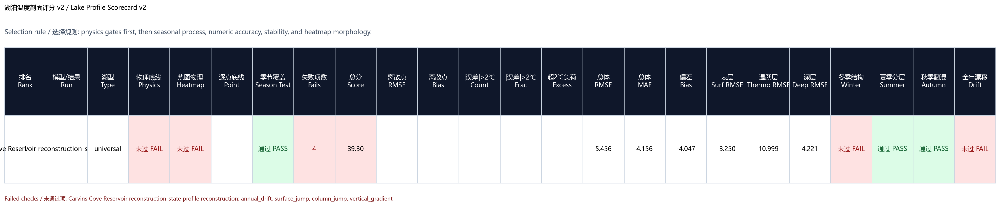
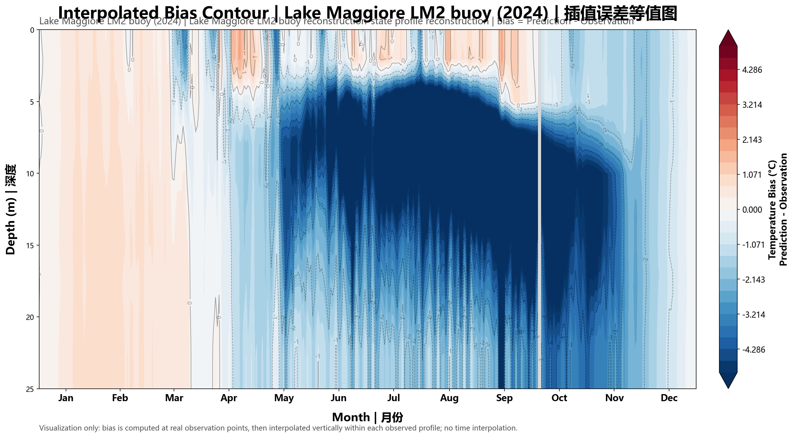

# LakePINN：物理约束湖泊温度剖面预测

LakePINN 是一个面向湖泊温度剖面预测的研究型实验仓库。项目以 ERA5 气象强迫、MODIS/LST 表面温度、湖泊静态属性和剖面观测为输入，预测逐日水温深度剖面 `T(z,t)`，并围绕物理一致性、跨湖泛化、长时段滚动稳定性和观测点误差进行评估。

当前推荐继续开发的主线是 [`第八版/lake_pinn`](./第八版/lake_pinn)。第八版延续 reconstruction-state / state-space forecaster 路线，重点推进跨湖泛化、扩展 metadata、temporal adaptive、LST dropout、segment LST weak loss、warm-column heat-content loss、roll60/export25 导出，以及 PGDL-WRR benchmark 对照工具化。

## Highlights

- 第八版是当前跨湖泛化主线，公开主结果来自 R9 epoch0099 的三湖整湖 heldout 评估。
- 第零版到第七版均保留在 `归档/`，用于回溯模型结构、数据流程和实验基线。
- README 只展示核心指标和少量代表图，完整实验记录见 [`EXPERIMENTS.md`](./EXPERIMENTS.md) 与各版本实验总结。
- 原始数据、checkpoint、预测 CSV、日志和完整实验目录不提交到 GitHub，避免仓库被本地大文件污染。

## 项目状态

这是研究型实验仓库，不是已发布的 Python 包。仓库只保存源码、测试、脚本、说明文档和少量代表图；完整实验目录、原始数据、checkpoint、预测 CSV、日志和压缩包保留在本地或单独发布位置。

主要目录：

```text
PINN-
|-- 第八版/              # 当前主线
|   |-- lake_pinn/
|   |-- tests/
|   |-- scripts/
|   `-- benchmarks/
|-- 归档/                # 历史版本
|-- docs/figures/        # 精选公开图像
|-- DATA.md
|-- MODEL.md
|-- EXPERIMENTS.md
`-- REPRODUCE.md
```

## 第八版结果快照

第八版主结果采用 `R9_WARMCOL_LST_SURFICE_ALL38_holdout3_120ep_roll60_export25_20260605` 的 `epoch0099` 导出结果。该实验使用 38 个 lake-year，其中 35 个训练、3 个整湖 heldout，rollout 约束为 60 天，并统一在 0-25 m 范围导出和评估。

| Heldout lake-year | RMSE | bias | 说明 |
|---|---:|---:|---|
| `lacawac_2016` | 2.405 | -0.244 | 三湖中最稳定，系统偏差较小 |
| `carvins_cove_2022` | 5.456 | -4.047 | 仍存在明显冷偏，是下一版重点问题 |
| `lake_maggiore_2024` | 3.708 | -2.191 | 比 R7 改善，但仍有冷偏 |
| 三湖平均 | 3.856 | 2.161 absolute bias | 相比 R7 的 4.158 / 2.455 有整体改善 |






更多指标和代表图见 [`第八版/实验总结.md`](./第八版/实验总结.md) 与 [`EXPERIMENTS.md`](./EXPERIMENTS.md)。

## 版本演进与更新说明

| 版本 | 位置 | 定位 | 最佳/代表记录 |
|---|---|---|---|
| 第八版 | [`第八版/`](./第八版) | 当前跨湖泛化主线，强化 extended metadata、temporal adaptive、LST dropout、warm-column heat-content 和 roll60 | R9 epoch0099，三湖平均 RMSE 3.856 |
| 第七版 | [`归档/第七版/`](./归档/第七版) | reconstruction-state / state-space forecaster 前一代主线 | Mendota T5 full free-roll RMSE 1.190 |
| 第六版 | [`归档/第六版/`](./归档/第六版) | multi-lake / few-shot 迁移基线 | Kinneret T54 RMSE 0.670，Sparkling few-shot RMSE 1.402 |
| 第五版 | [`归档/第五版/`](./归档/第五版) | Mohonk raw PINN 单湖基线 | T34 raw PINN RMSE 1.250 |
| 第四版 | [`归档/第四版/`](./归档/第四版) | 模块化 LakePINN 对照 | run9 resume RMSE 1.478 |
| 第三版 | [`归档/第三版/`](./归档/第三版) | 11 维 PINN + PPO/Kalman 单文件主线 | 11维测试/九 RMSE 1.498 |
| 第二版 | [`归档/第二版/`](./归档/第二版) | 旧输入结构 PPO 数值对照 | 策略测试/七 RMSE 1.051 |
| 第一版 | [`归档/第一版/`](./归档/第一版) | 早期下载、处理和建模流程整理 | 历史留档 |
| 第零版 | [`归档/第零版/`](./归档/第零版) | 最早期集中式脚本和流程验证 | 历史留档 |

### 第八版：跨湖泛化主线

第八版把第七版的 reconstruction-state / state-space forecaster 推向更严格的跨湖泛化评估。主结果 `R9_WARMCOL_LST_SURFICE_ALL38_holdout3_120ep_roll60_export25_20260605` 使用 38 个 lake-year，其中 35 个用于训练，`lacawac_2016`、`carvins_cove_2022`、`lake_maggiore_2024` 作为整湖 heldout。公开结果采用 `epoch0099` 导出，三湖平均 RMSE 为 `3.856`，平均绝对 bias 为 `2.161`。R9 相比 R7 有整体改善，但 `carvins_cove_2022` 仍存在明显冷偏，是下一版的重点问题。

### 第七版：状态空间预测器

第七版从第六版 multi-lake / few-shot 路线切换到 reconstruction-state / state-space forecaster：模型先重建当前剖面状态，再结合 forcing 和湖泊属性推进后续剖面。该版加入 heat-content transition loss、bulk turbulent flux、latent reservoir freezing mode、hard density stability、segment rollout loss 和 rolling horizon evaluation。代表实验 `T5_Mendota2020_bulkFlux_kz15_heat005_200ep_cloud` 在 Mendota 2020 full free-roll 上达到 RMSE `1.190`、MAE `0.837`、bias `-0.466`，比 T4 更适合作为长时段 free-roll 主线。

### 第六版：多湖迁移与 few-shot

第六版在第五版 raw PINN 基础上引入 global backbone + lake adapter/residual，用于多湖联合训练、leave-one-lake zero-shot 和目标湖 few-shot 适配。该版新增 lake attribute 输入、LST 质量权重、warm/deep lake 物理门控和 Richardson-number-dependent eddy diffusivity 测试。代表结果包括 Kinneret 单湖 `T54` RMSE `0.670`、MAE `0.443`、bias `-0.159`，以及 Sparkling few-shot `lakeSpecificResidual_softBound_surfaceUniform_20d` RMSE `1.402`、MAE `1.078`、bias `0.340`。

### 第五版：Mohonk raw PINN 基线

第五版将预测主线收敛到 raw PINN：默认不再依赖 rolling prediction、Kalman 同化或 PPO 预测调度，相关能力只作为可选对照和诊断保留。该版升级到 27 维扩展输入，加入 past-only weather memory、previous-state memory、seasonal blocked split、profile-grid physics、density regularization 和 scorecard v2。代表实验 `T34_rawPINN_noRolling_noKalman_noPPO_20260511` 在 Mohonk 2017 上达到 RMSE `1.250`、MAE `0.830`、bias `-0.069`，但 density stability 仍需继续优化。

### 第四版：模块化 LakePINN 对照

第四版把第三版之后的主线从单文件脚本整理成 `lake_pinn` 包，并新增 `python -m lake_pinn` 命令行入口。训练、预测、Kalman 同化、PPO 调度、标准输入和 scorecard 由模块化 pipeline 管理，便于后续维护和扩展。代表实验 `run9_resume_train_20260509` 达到 RMSE `1.478`、MAE `0.999`、bias `0.060`，作为第五版之前的模块化对照。

### 第三版：11 维 PINN + PPO/Kalman 单文件主线

第三版保留了 11 维 PINN / PPO 主线、热收支 A 线和 `lake_profile_scorecard.py` 分层评分工具。该版的重点不是工程模块化，而是稳定验证 PINN + PPO/Kalman 路线下的季节结构、物理底线和观测点评分。代表实验 `11维测试/九` 达到 RMSE `1.498`、MAE `1.061`、bias `0.188`，作为第四版前的稳定单文件对照。

### 第二版：旧输入结构 PPO 策略控制

第二版承载早期 `PINN + PPO` 联合控制路线，默认脚本为 `PPO策略控制.py`。该版重点验证物理约束训练、checkpoint 继续实验和策略调节能否改善湖泊温度剖面预测。代表实验 `策略测试/七` RMSE `1.051`、MAE `0.734`、bias `0.024`，是历史数值最优之一，但输入结构和工程组织已经不适合作为当前主线。

### 第一版：下载、处理和建模流程整理

第一版把第零版中分散的下载、数据处理、可视化和建模脚本整理为更清晰的目录入口，主要包含 ERA5/MODIS LST 数据下载转换、原始数据可视化、温度剖面热图绘制和预测验证流程。该版作为早期工程整理阶段保留，不作为当前模型对照主线。

### 第零版：最早期集中式脚本验证

第零版是项目最早期的集中式脚本阶段，完成 ERA5、MODIS LST、PINN 建模、温度深度热图和观测模拟对比的基础流程验证。它的价值主要在于记录项目从数据下载到模型评估的原始闭环，不再作为后续开发入口。

## 快速开始

```powershell
pip install -r requirements.txt
Push-Location ".\第八版"
python -m lake_pinn --help
Pop-Location
```

训练或导出需要准备 manifest，示例：

```powershell
Push-Location ".\第八版"
python -m lake_pinn `
  --manifest "..\path\to\manifest.json" `
  --output-dir "..\outputs\v8_run" `
  --epochs 120 `
  --device cpu
Pop-Location
```

## 不提交的内容

以下内容保留在本地实验目录，不直接提交到 GitHub：

- 原始数据、验证数据和标准化输入数据。
- 训练 checkpoint，例如 `*.pt`、`*.pth`、`*.ckpt`。
- 完整 `experiments/`、`external/`、`_archive/` 目录。
- 预测 CSV、scorecard CSV、diagnostics CSV、批量 PNG、日志、zip 包和进程文件。
- `__pycache__/`、`.pytest_cache/`、`.pyc` 等缓存。

仓库中的 PNG 仅限 `docs/figures/` 下精选代表图。
