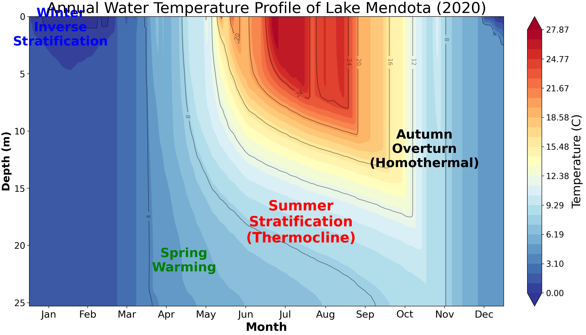
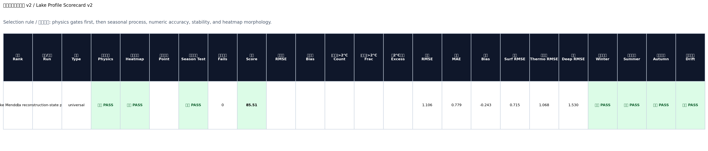
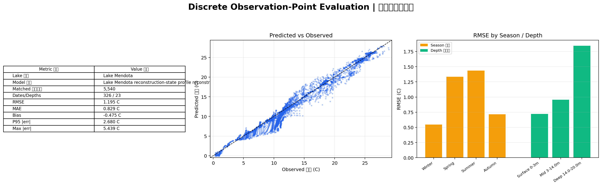
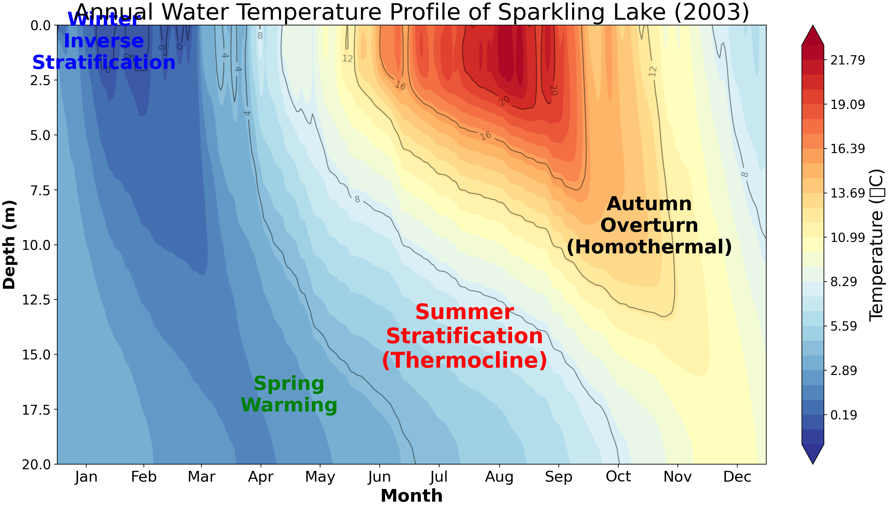
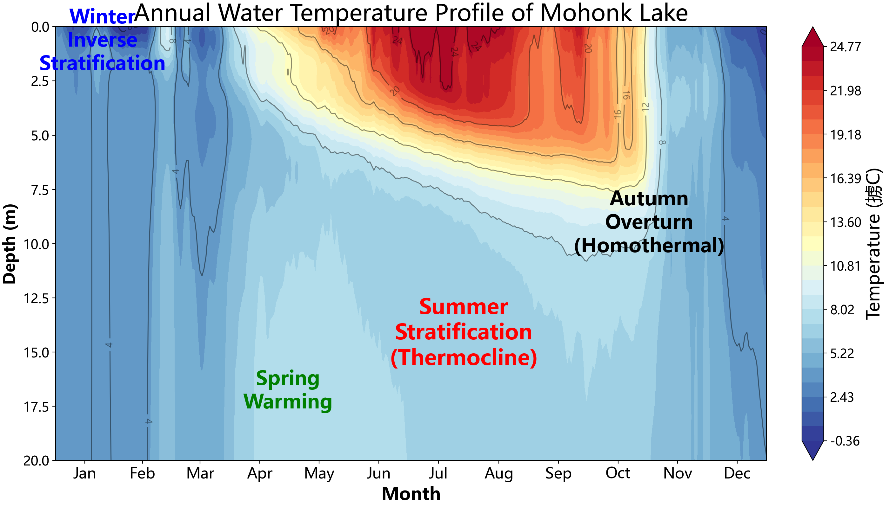
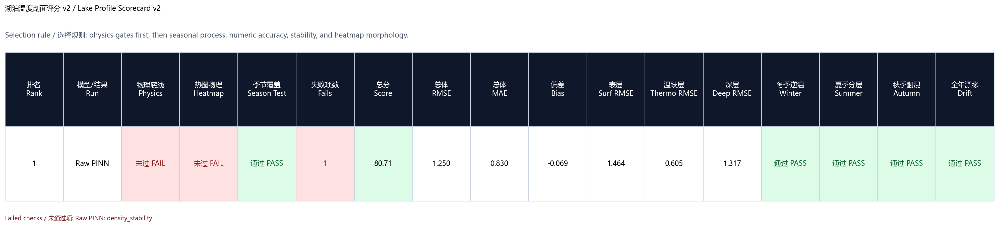
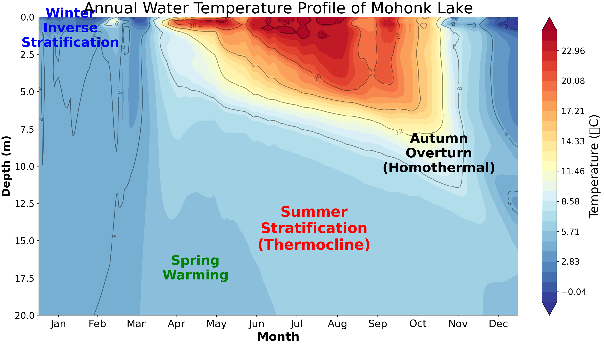
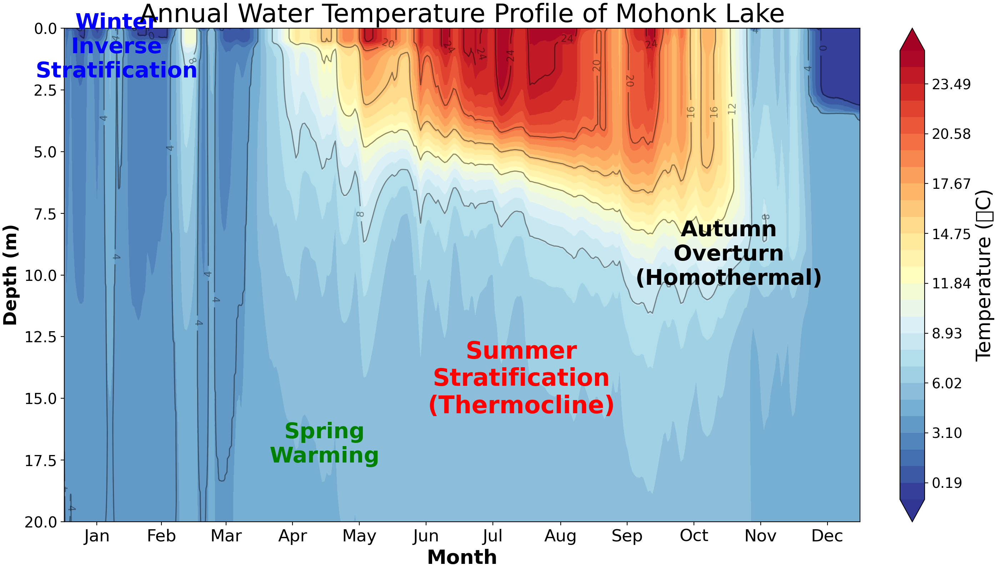

# PINN-

湖泊温度剖面预测与物理约束 PINN / PPO 实验仓库。项目以 ERA5 气象强迫、MODIS LST 表面温度和湖泊剖面观测为输入，预测湖泊逐日水温深度剖面 `T(z,t)`，并用物理约束、Kalman 同化和 PPO 调度改进季节结构与数值精度。

当前推荐继续研究的主入口是 `第七版/lake_pinn/`。第七版把主线切换为 reconstruction-state / state-space forecaster，重点验证剖面状态推进、热含量约束、free-roll 稳定性和云端 GPU 长实验。第六版已移入 `归档/第六版/`，保留为 multi-lake / few-shot 归档基线；第五版、第四版和第三版也保留在 `归档/` 中作为历史对照。

## 项目状态

这是一个研究型实验仓库，而不是打包发布的 Python 库。仓库只保存代码、文档、精简结论和少量代表图像；原始数据、训练 checkpoint、预测 CSV 和大批量实验输出保留在本地或单独发布位置。

当前定位：

- `第七版/lake_pinn/` 是当前 reconstruction-state 主线，支持 state forecaster、多湖 manifest、heat-content transition、bulk turbulent flux、segment rollout 和 free-roll 评估。
- `归档/第六版/lake_pinn/` 是 multi-lake / few-shot 归档基线，支持 global adapter、few-shot adapter、湖泊静态属性和 warm/deep lake 物理约束。
- `归档/第五版/lake_pinn/` 是 Mohonk raw PINN 基线，支持 27 维扩展输入、profile-grid physics、density regularization 和 scorecard v2。
- `归档/第四版/lake_pinn/` 是第四版模块化 LakePINN 对照，支持 PINN、PPO、Kalman、滚动预测和分层评分。
- `归档/第三版/PPO策略调控_11维主线_20260426.py` 是已归档的 11 维 PINN + PPO/Kalman 单文件主线。
- `归档/第三版/PPO策略调控_热收支A线_20260428.py` 是已归档的热收支 A 线实验方向。
- `归档/第二版/PPO策略控制.py` 是历史数值最优对照，不作为当前主线继续扩展。

## 数据与大文件说明

本仓库只提交源码、文档、精简实验结论和少量代表图像。以下内容建议保留在本地实验目录或单独发布位置，不直接提交到 GitHub：

- 原始数据和验证数据。
- 训练 checkpoint，例如 `*.pt`、`*.pth`、`*.ckpt`。
- 预测输出 CSV、完整热图 PNG 和批量评分结果。
- `experiments/`、`11维测试/`、`策略测试/`、`score_outputs*/` 等大批量实验目录。
- 云端运行包和日志，例如 `*.zip`、`*.log`、`pid.txt`。

README 中只保留关键指标、代表性热图和版本更新说明；需要公开完整结果时，再整理为论文、报告或单独的数据发布包。

## 结果快照

以下结果基于各实验对应湖泊/年份的预测 CSV 与剖面观测对齐后的评分。模型选择不能只看 RMSE，还需要结合冬季逆温、夏季分层、秋季翻混、漂移和温跃层结构。

| 实验 | RMSE | MAE | bias | 当前判断 |
|---|---:|---:|---:|---|
| `T5_Mendota2020_bulkFlux_kz15_heat005_200ep_cloud` | 1.190 | 0.837 | -0.466 | 第七版主结果，Mendota 2020 full free-roll 最稳 |
| `T4_Mendota2020_bulkFlux_kz20_heat005_200ep_sample4_eval10_rerun1` | 1.529 | 1.043 | -0.762 | 第七版对照，transition 略低但长时段稳定性不如 T5 |
| `R_free_roll_fix/sparkling_R2_reslim025_20260517` | 3.266 | 2.504 | 0.250 | 第七版 Sparkling future-year free-roll 对照 |
| `T54_Kinneret修复时间步长后T51微调` | 0.670 | 0.443 | -0.159 | 归档第六版 Kinneret 单湖最优，物理底线通过 |
| `Sparkling lakeSpecificResidual softBound surfaceUniform 20d` | 1.402 | 1.078 | 0.340 | 第六版 few-shot 最优，20 个剖面日期适配且物理底线通过 |
| `LOO_03 Mendota zero-shot` | 1.079 | - | - | 第六版 leave-one-lake 最优，训练摘要 test RMSE |
| `T34_rawPINN_noRolling_noKalman_noPPO_20260511` | 1.250 | 0.830 | -0.069 | 第五版 Mohonk raw PINN 基线；scorecard v2=80.71，密度稳定性仍需优化 |
| `策略测试/七` | 1.051 | 0.734 | 0.024 | 数值精度最好，旧输入结构对照 |
| `11维测试/九` | 1.498 | 1.061 | 0.188 | 已归档 11 维稳定对照 |
| `run9_resume_train_20260509` | 1.478 | 0.999 | 0.060 | 归档第四版续训候选增强 |
| `official_predict_kalman` | 1.567 | 1.084 | 0.095 | 归档第四版官方预测 Kalman 对照 |
| `11维测试/十六` | 1.557 | 1.106 | 0.213 | 热收支 A3，对主线有参考价值 |
| `11维测试/十七` | 1.672 | 1.172 | 0.282 | A4 预测侧仍需改进 |

更完整的实验定位见 [`EXPERIMENTS.md`](./EXPERIMENTS.md)。

## 代表图像

第七版 Mendota T5 reconstruction-state 年度热图：



第七版 Mendota T5 scorecard 摘要：



第七版 Mendota T5 离散观测点评估：



第七版 Sparkling R2 future-year 年度热图：



归档第六版 Kinneret T54 单湖最优年度热图：


第六版 Sparkling 20d few-shot 最优年度热图：


第六版 Mendota leave-one-lake zero-shot 年度热图：


第五版 Mohonk raw PINN 基线 `T34_rawPINN_noRolling_noKalman_noPPO_20260511` 的 Mohonk 2017 年度温度剖面热图：



第五版 T34 的 scorecard v2 评分摘要图：



归档 11 维对照 `11维测试/九` 的 Mohonk 2017 年度温度剖面热图：


Mohonk 2017 关键版本误差对比：


归档 11 维对照 `11维测试/九` 的月-深度误差诊断图。下图将每日预测剖面与 0-13 m 观测网格对齐后，按月份和深度统计误差；RMSE 反映误差强度，bias 反映预测相对观测的系统性偏高或偏低。该诊断显示，误差主要集中在春季表层升温阶段和秋季中深层翻混阶段。


第二版历史数值最优对照 `策略测试/七` 的年度温度剖面热图：



第四版官方 Kalman 对照的年度温度剖面热图：



## 快速入口

- 第七版当前主入口：[`第七版/lake_pinn`](./第七版/lake_pinn)
- 第七版更新说明：[`第七版/更新说明.md`](./第七版/更新说明.md)
- 第七版实验总结：[`第七版/实验总结.md`](./第七版/实验总结.md)
- 已归档第六版：[`归档/第六版/lake_pinn`](./归档/第六版/lake_pinn)
- 第六版更新说明：[`归档/第六版/更新说明.md`](./归档/第六版/更新说明.md)
- 第六版实验总结：[`归档/第六版/实验总结.md`](./归档/第六版/实验总结.md)
- 已归档第五版 Mohonk raw PINN 基线：[`归档/第五版/lake_pinn`](./归档/第五版/lake_pinn)
- 第五版更新说明：[`归档/第五版/更新说明.md`](./归档/第五版/更新说明.md)
- 当前评分工具：[`第七版/lake_pinn/lake_profile_scorecard.py`](./第七版/lake_pinn/lake_profile_scorecard.py)
- 已归档第四版：[`归档/第四版/lake_pinn`](./归档/第四版/lake_pinn)
- 已归档 11 维单文件主线：[`归档/第三版/PPO策略调控_11维主线_20260426.py`](./归档/第三版/PPO策略调控_11维主线_20260426.py)
- 已归档热收支实验线：[`归档/第三版/PPO策略调控_热收支A线_20260428.py`](./归档/第三版/PPO策略调控_热收支A线_20260428.py)
- 复现说明：[`REPRODUCE.md`](./REPRODUCE.md)
- 数据格式说明：[`DATA.md`](./DATA.md)
- 模型原理说明：[`MODEL.md`](./MODEL.md)
- 实验结论摘要：[`EXPERIMENTS.md`](./EXPERIMENTS.md)

## 版本演进与更新说明

| 版本 | 位置 | 主要更新 | 当前状态 |
|---|---|---|---|
| 第七版 | [`第七版/lake_pinn`](./第七版/lake_pinn) | 当前 reconstruction-state 主线。新增 state forecaster、hypsometry-aware vertical solver、heat-content transition、bulk turbulent flux、latent reservoir freezing mode、segment rollout loss 和云端 GPU 长实验脚本。 | 当前推荐继续开发 |
| 第六版 | [`归档/第六版/lake_pinn`](./归档/第六版/lake_pinn) | multi-lake / few-shot 迁移主线。新增 global adapter、lake-attribute residual、few-shot adapter、warm/deep lake 物理门控、Richardson 数扩散和跨湖实验总结。 | 已归档为第七版前的多湖迁移基线 |
| 第五版 | [`归档/第五版/lake_pinn`](./归档/第五版/lake_pinn) | raw PINN 单湖主线。默认输入维度升级为 27 维，引入 past-only weather memory、previous-state memory、profile-grid physics、density regularization、bottom slow-change 和 scorecard v2。预测侧默认使用 raw PINN，rolling、Kalman 和 PPO 保留为可选对照或诊断。 | 已归档为 Mohonk raw PINN 基线 |
| 第四版 | [`归档/第四版/lake_pinn`](./归档/第四版/lake_pinn) | 将 run9 后续主线从单文件整理为模块化 Python 包，拆分训练、预测、Kalman、PPO、标准输入构建和评分工具。新增官方预测输出选择逻辑，启用 Kalman 时以同化输出作为展示/评分优先结果。 | 已归档为第五版前的模块化对照 |
| 第三版 | [`归档/第三版`](./归档/第三版) | 形成 11 维 PINN + PPO/Kalman 单文件主线，并加入热收支 A 线实验和剖面分层评分工具。`11维测试/九` 是该阶段稳定对照，热收支 A3/A4 说明能量约束有潜力但预测侧仍需改进。 | 已归档为稳定单文件对照 |
| 第二版 | [`归档/第二版`](./归档/第二版) | 旧输入结构 PPO 版本，对应 `策略测试/七`。在 Mohonk 2017 上取得过最低 RMSE，但输入结构和后续主线不一致。 | 已归档为历史数值基线 |
| 第一版 | [`归档/第一版`](./归档/第一版) | 早期将数据下载、处理、可视化和预测建模分目录整理，形成从数据爬取到结果验证的初始流程。 | 已归档为早期流程参考 |
| 第零版 | [`归档/第零版`](./归档/第零版) | 项目最早期的集中式脚本和数据处理尝试，保留原始实现思路和早期物理参数/下载流程。 | 已归档为历史留档 |

简要路线是：第零版和第一版搭建数据与早期预测流程，第二版取得历史最低 RMSE 对照，第三版转向 11 维物理主线，第四版完成模块化整理，第五版推进 raw PINN 和训练侧结构约束，第六版扩展到多湖泛化和 few-shot 迁移，第七版转向 reconstruction-state 状态推进和长时段 free-roll 稳定性。

## 各版本最佳实验记录

| 版本 | 最佳/代表实验 | RMSE | MAE | bias | 热图/报告 | 说明 |
|---|---|---:|---:|---:|---|---|
| 第七版 | `T5_Mendota2020_bulkFlux_kz15_heat005_200ep_cloud` | 1.190 | 0.837 | -0.466 | [年度热图](./docs/figures/lakepinn_v7_mendota_t5_year_heatmap.png)、[scorecard](./docs/figures/lakepinn_v7_mendota_t5_scorecard_report.png)、[离散点评估](./docs/figures/lakepinn_v7_mendota_t5_discrete_point_evaluation.png) | Mendota 2020 full free-roll 主结果；heldout transition RMSE 为 0.331，30d free-roll RMSE 为 1.000 |
| 第六版 | `T54_Kinneret修复时间步长后T51微调` | 0.670 | 0.443 | -0.159 | [年度热图](./docs/figures/lakepinn_v6_kinneret_t54_year_heatmap.png)、[scorecard](./docs/figures/lakepinn_v6_kinneret_t54_scorecard_report.png) | Kinneret 单湖最优；Sparkling few-shot 最优为 RMSE 1.402，Mendota LOO zero-shot test RMSE 为 1.079 |
| 第五版 | `T34_rawPINN_noRolling_noKalman_noPPO_20260511` | 1.250 | 0.830 | -0.069 | [年度热图](./docs/figures/mohonk_2017_v5_t34_raw_pinn_year_heatmap.png)、[scorecard](./docs/figures/mohonk_2017_v5_t34_scorecard_report.png) | Mohonk raw PINN 基线，scorecard v2 为 80.71；数值明显改善，但 density stability 仍未通过 |
| 第四版 | `run9_resume_train_20260509` | 1.478 | 0.999 | 0.060 | [Kalman 年度热图](./docs/figures/mohonk_2017_v4_official_kalman_year_heatmap.png) | 续训候选是该阶段 RMSE 最优；官方 Kalman 展示对照为 RMSE 1.567 / MAE 1.084 / bias 0.095 |
| 第三版 | `11维测试/九` | 1.498 | 1.061 | 0.188 | [年度热图](./docs/figures/mohonk_2017_11d9_year_heatmap.png)、[RMSE 月深度热图](./docs/figures/mohonk_2017_11d9_rmse_heatmap_month_depth.png)、[bias 月深度热图](./docs/figures/mohonk_2017_11d9_bias_heatmap_month_depth.png) | 11 维 PINN + PPO/Kalman 单文件主线的稳定归档对照 |
| 第二版 | `策略测试/七` | 1.051 | 0.734 | 0.024 | [年度热图](./docs/figures/mohonk_2017_v2_run7_year_heatmap.png) | 历史最低 RMSE，对旧输入结构很有参考价值，但不直接替代当前主线 |
| 第一版 | 早期数据处理与预测流程 | - | - | - | - | 未保留统一 Mohonk 2017 scorecard；主要价值是数据下载、清洗、可视化和初始建模流程 |
| 第零版 | 原始集中式脚本与数据处理尝试 | - | - | - | - | 未形成标准化可比实验；作为早期实现思路和历史留档 |

## 环境

建议使用 Python 3.10 或更新版本。

```powershell
pip install -r requirements.txt
```

根目录 `requirements.txt` 覆盖当前第七版主线代码。归档目录中的早期下载脚本可能还需要额外依赖，例如 `cdsapi`、`xarray` 或 `seaborn`。

## 数据与复现

运行第七版训练或导出前，需要按 [`DATA.md`](./DATA.md) 准备 manifest 指向的输入：

- ERA5 daily forcing CSV。
- MODIS LST surface observation CSV。
- 可选 profile observation CSV，用于训练、同化和评分。
- 可选已训练 state-forecaster checkpoint，用于 `--export-only` 或续训。

公开复现模板见 [`REPRODUCE.md`](./REPRODUCE.md)。当前机器上的绝对路径可放在未提交的 `REPRODUCE_LOCAL.md` 中，该文件已加入 `.gitignore`。

## 最小运行示例

训练第七版 reconstruction-state 模型：

```powershell
Push-Location ".\第七版"
python -m lake_pinn `
  --manifest "..\path\to\manifest.json" `
  --output-dir "..\outputs\v7_run" `
  --epochs 200 `
  --device cpu
Pop-Location
```

使用已训练 checkpoint 导出：

```powershell
Push-Location ".\第七版"
python -m lake_pinn `
  --manifest "..\path\to\manifest.json" `
  --checkpoint-path "..\outputs\v7_run\global_state_forecaster_checkpoint.pt" `
  --output-dir "..\outputs\v7_export" `
  --export-only `
  --device cpu
Pop-Location
```

评分预测结果：

```powershell
python ".\第七版\lake_pinn\lake_profile_scorecard.py" `
  --truth "path\to\profile_truth.csv" `
  --pred "outputs\predict_main\mohonk_lake_2017_pinn_temperature_depth_predictions.csv" `
  --label "main_predict" `
  --out-dir "outputs\score_main"
```

## 版本定位

| 目录/脚本 | 定位 | 对应实验 | 当前判断 |
|---|---|---|---|
| `第七版/lake_pinn/` | reconstruction-state / state-space forecaster 主线 | `T5_Mendota2020...`、`Sparkling R2` | 当前推荐继续开发 |
| `归档/第六版/lake_pinn/` | 多湖 global adapter + few-shot 迁移主线 | `T54_Kinneret...`、`Sparkling few-shot 20d`、`LOO_03 Mendota` | 已归档为第七版前的多湖迁移基线 |
| `归档/第五版/lake_pinn/` | raw PINN + 训练侧结构约束单湖基线 | `T34_rawPINN_noRolling_noKalman_noPPO_20260511` | 已归档为 Mohonk raw PINN 基线 |
| `归档/第四版/lake_pinn/` | 模块化 PINN + PPO/Kalman 候选主线 | `run9_resume_train_20260509`、`official_predict_*` | 已归档为模块化对照 |
| `归档/第三版/PPO策略调控_11维主线_20260426.py` | 11 维 PINN + PPO/Kalman 单文件主线 | `11维测试/九` | 已归档为稳定对照 |
| `归档/第三版/PPO策略调控_热收支A线_20260428.py` | 能量版热收支实验线 | `11维测试/十一` 到 `11维测试/十七` | 已归档，有参考价值 |
| `归档/第二版/PPO策略控制.py` | 旧输入结构 PPO | `策略测试/七` | 数值 RMSE 最低，但不作为当前主线 |
| `归档/第一版`、`归档/第零版` | 早期历史版本 | 早期流程 | 仅用于回溯 |

## 仓库结构

```text
PINN-
|-- README.md
|-- DATA.md
|-- MODEL.md
|-- EXPERIMENTS.md
|-- REPRODUCE.md
|-- requirements.txt
|-- 第七版/
|   |-- README.md
|   |-- 更新说明.md
|   |-- 实验总结.md
|   |-- lake_pinn/
|   |-- scripts/
|   `-- tests/
`-- 归档/
    |-- 第六版/
    |-- 第五版/
    |   |-- README.md
    |   |-- 更新说明.md
    |   `-- lake_pinn/
    |-- 第四版/
    |-- 第三版/
    |-- 第二版/
    |-- 第一版/
    `-- 第零版/
```

## 不提交的内容

以下内容建议保留在本地实验目录，不直接提交到 GitHub：

- 原始数据和验证数据。
- 训练 checkpoint，例如 `*.pt`、`*.pth`、`*.ckpt`。
- 预测输出 CSV 和完整/批量热图 PNG。
- `11维测试/`、`策略测试/`、`score_outputs*/` 等大批量实验结果目录。

这些内容更适合在论文、报告或发布版本中整理为摘要表、评分表和代表性图像。
