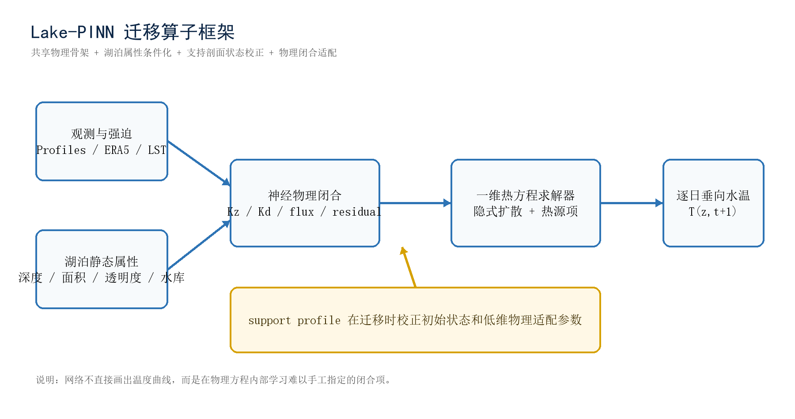
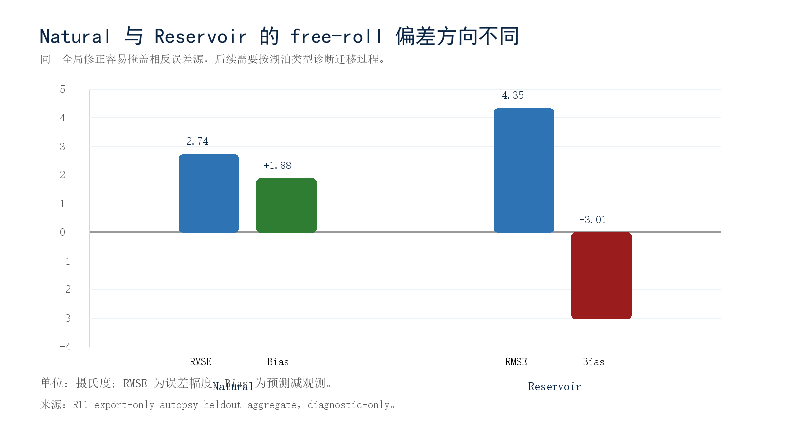

# LakePINN：物理约束湖泊温度剖面预测

LakePINN 是一个面向湖泊温度剖面预测的研究型实验仓库。项目以 ERA5 气象强迫、MODIS/LST 表面温度、湖泊静态属性和剖面观测为输入，预测逐日水温深度剖面 `T(z,t)`，并围绕物理一致性、跨湖泛化、长时段滚动稳定性和观测点误差进行评估。

当前推荐继续开发的主线是 [`第九版/lake_pinn`](./第九版/lake_pinn)。第九版延续 reconstruction-state / state-space forecaster 路线，重点转向 zero-profile reconstruction、support profile 状态校正、few-shot 迁移诊断、LSWT observer autopsy 和分层实验编排。

## Highlights

- 第九版是当前 reconstruction 诊断主线，公开主记录来自 `RECON_L3_SUPPORT_DELTA_MAGNITUDE_OVERNIGHT_v1`。
- 第八版已归档，作为跨湖泛化 R9 warm-column 主结果基线保留。
- 第零版到第八版均保留在 `归档/`，用于回溯模型结构、数据流程和实验基线。
- README 只展示核心指标和少量代表图，完整实验记录见 [`EXPERIMENTS.md`](./EXPERIMENTS.md) 与各版本实验总结。

## 项目状态

这是研究型实验仓库，不是已发布的 Python 包。仓库只保存源码、测试、脚本、说明文档和少量代表图；完整实验目录、原始数据、checkpoint、预测 CSV、日志和压缩包保留在本地或单独发布位置。

主要目录：

```text
PINN-
|-- 第九版/              # 当前主线
|   |-- lake_pinn/
|   |-- tests/
|   `-- scripts/
|-- 归档/                # 历史版本
|-- docs/figures/        # 精选公开图像
|-- DATA.md
|-- MODEL.md
|-- EXPERIMENTS.md
`-- REPRODUCE.md
```

## 第九版结果快照

第九版主记录采用 `RECON_L3_SUPPORT_DELTA_MAGNITUDE_OVERNIGHT_v1` 的 `best_by_val_rolling` checkpoint。该实验用于评估 support profile 对 reconstruction-state 初始状态和少样本迁移的修正能力，公开指标以 validation few-shot 30d/60d 和 rolling-start 30d/60d 为主。

| 记录 | epoch | score | few-shot 30d RMSE | few-shot 60d RMSE | rolling-start 30d RMSE | rolling-start 60d RMSE |
|---|---:|---:|---:|---:|---:|---:|
| `RECON_L3_SUPPORT_DELTA_MAGNITUDE_OVERNIGHT_v1` | 47 | 2.441 | 2.486 | 2.396 | 1.995 | 2.233 |
| `RECON_L3_SUPPORT_DELTA_MAGNITUDE_DIAG_v1` | 11 | 3.630 | 3.828 | 3.432 | 2.226 | 2.528 |
| `RECON_L2_SINGLELAKE_RECON_SANITY_v1` | 17 | 3.007 | - | - | 2.558 | 3.457 |

诊断结论：

- 1d closed-loop 与 teacher-forced transition 评估一致性通过：checkpoint validation transition RMSE `0.300`，rolling 1d RMSE `0.308`。
- support update 会把 query-start prior profile 朝观测 query-start profile 推近：checkpoint validation corrected RMSE 比 base RMSE 低 `0.106 C`，无泄漏记录。
- R11 export-only 诊断显示观测锚定可以显著降低 export 误差，但 Natural 与 Reservoir 的 free-roll 偏差方向相反，需要按湖泊类型继续诊断。






更多指标见 [`第九版/实验总结.md`](./第九版/实验总结.md) 与 [`EXPERIMENTS.md`](./EXPERIMENTS.md)。

## 版本演进与更新说明

| 版本 | 位置 | 定位 | 最佳/代表记录 |
|---|---|---|---|
| 第九版 | [`第九版/`](./第九版) | 当前 reconstruction 诊断与 few-shot support 主线 | L3 overnight few-shot 30d RMSE 2.486，60d RMSE 2.396 |
| 第八版 | [`归档/第八版/`](./归档/第八版) | 跨湖泛化主线，强化 extended metadata、temporal adaptive、LST dropout、warm-column heat-content 和 roll60 | R9 epoch0099，三湖平均 RMSE 3.856 |
| 第七版 | [`归档/第七版/`](./归档/第七版) | reconstruction-state / state-space forecaster 前一代主线 | Mendota T5 full free-roll RMSE 1.190 |
| 第六版 | [`归档/第六版/`](./归档/第六版) | multi-lake / few-shot 迁移基线 | Kinneret T54 RMSE 0.670，Sparkling few-shot RMSE 1.402 |
| 第五版 | [`归档/第五版/`](./归档/第五版) | Mohonk raw PINN 单湖基线 | T34 raw PINN RMSE 1.250 |
| 第四版 | [`归档/第四版/`](./归档/第四版) | 模块化 LakePINN 对照 | run9 resume RMSE 1.478 |
| 第三版 | [`归档/第三版/`](./归档/第三版) | 11 维 PINN + PPO/Kalman 单文件主线 | 11维测试/九 RMSE 1.498 |
| 第二版 | [`归档/第二版/`](./归档/第二版) | 旧输入结构 PPO 数值对照 | 策略测试/七 RMSE 1.051 |
| 第一版 | [`归档/第一版/`](./归档/第一版) | 早期下载、处理和建模流程整理 | 历史留档 |
| 第零版 | [`归档/第零版/`](./归档/第零版) | 最早期集中式脚本和流程验证 | 历史留档 |

### 第九版：reconstruction 诊断与 support 迁移

第九版在第八版跨湖泛化主线之后，重点排查 zero-profile reconstruction、support profile 校正和 few-shot 迁移失败来源。该版新增 pipeline controller、tiered smoke 生成、R19/R20/R22/R23/R27-R35 等诊断脚本，并在 `state_reconstruction.py` 与 `state_multilake.py` 中强化 sparse observer、support assimilation、zero-profile LSWT observer 和诊断导出能力。当前主记录是 `RECON_L3_SUPPORT_DELTA_MAGNITUDE_OVERNIGHT_v1`，few-shot 30d/60d RMSE 分别为 `2.486` / `2.396`。

### 第八版：跨湖泛化主线

第八版把第七版的 reconstruction-state / state-space forecaster 推向更严格的跨湖泛化评估。主结果 `R9_WARMCOL_LST_SURFICE_ALL38_holdout3_120ep_roll60_export25_20260605` 使用 38 个 lake-year，其中 35 个用于训练，`lacawac_2016`、`carvins_cove_2022`、`lake_maggiore_2024` 作为整湖 heldout。公开结果采用 `epoch0099` 导出，三湖平均 RMSE 为 `3.856`，平均绝对 bias 为 `2.161`。R9 相比 R7 有整体改善，但 `carvins_cove_2022` 仍存在明显冷偏。

### 第七版：状态空间预测器

第七版从第六版 multi-lake / few-shot 路线切换到 reconstruction-state / state-space forecaster：模型先重建当前剖面状态，再结合 forcing 和湖泊属性推进后续剖面。代表实验 `T5_Mendota2020_bulkFlux_kz15_heat005_200ep_cloud` 在 Mendota 2020 full free-roll 上达到 RMSE `1.190`、MAE `0.837`、bias `-0.466`。

### 第六版：多湖迁移与 few-shot

第六版在第五版 raw PINN 基础上引入 global backbone + lake adapter/residual，用于多湖联合训练、leave-one-lake zero-shot 和目标湖 few-shot 适配。代表结果包括 Kinneret 单湖 `T54` RMSE `0.670`、MAE `0.443`、bias `-0.159`，以及 Sparkling few-shot RMSE `1.402`、MAE `1.078`、bias `0.340`。

### 第五版：Mohonk raw PINN 基线

第五版将预测主线收敛到 raw PINN：默认不再依赖 rolling prediction、Kalman 同化或 PPO 预测调度，相关能力只作为可选对照和诊断保留。代表实验 `T34_rawPINN_noRolling_noKalman_noPPO_20260511` 在 Mohonk 2017 上达到 RMSE `1.250`、MAE `0.830`、bias `-0.069`。

### 第四版：模块化 LakePINN 对照

第四版把第三版之后的主线从单文件脚本整理成 `lake_pinn` 包，并新增 `python -m lake_pinn` 命令行入口。代表实验 `run9_resume_train_20260509` 达到 RMSE `1.478`、MAE `0.999`、bias `0.060`。

### 第三版：11 维 PINN + PPO/Kalman 单文件主线

第三版保留了 11 维 PINN / PPO 主线、热收支 A 线和 `lake_profile_scorecard.py` 分层评分工具。代表实验 `11维测试/九` 达到 RMSE `1.498`、MAE `1.061`、bias `0.188`。

### 第二版：旧输入结构 PPO 策略控制

第二版承载早期 `PINN + PPO` 联合控制路线，默认脚本为 `PPO策略控制.py`。代表实验 `策略测试/七` RMSE `1.051`、MAE `0.734`、bias `0.024`，是历史数值最优之一，但输入结构和工程组织已经不适合作为当前主线。

### 第一版：下载、处理和建模流程整理

第一版把第零版中分散的下载、数据处理、可视化和建模脚本整理为更清晰的目录入口，主要包含 ERA5/MODIS LST 数据下载转换、原始数据可视化、温度剖面热图绘制和预测验证流程。

### 第零版：最早期集中式脚本验证

第零版是项目最早期的集中式脚本阶段，完成 ERA5、MODIS LST、PINN 建模、温度深度热图和观测模拟对比的基础流程验证。

## 快速开始

```powershell
pip install -r requirements.txt
Push-Location ".\第九版"
python -m lake_pinn --help
Pop-Location
```

训练或导出需要准备 manifest，示例：

```powershell
Push-Location ".\第九版"
python -m lake_pinn `
  --manifest "..\path\to\manifest.json" `
  --output-dir "..\outputs\v9_run" `
  --epochs 120 `
  --device cpu
Pop-Location
```
