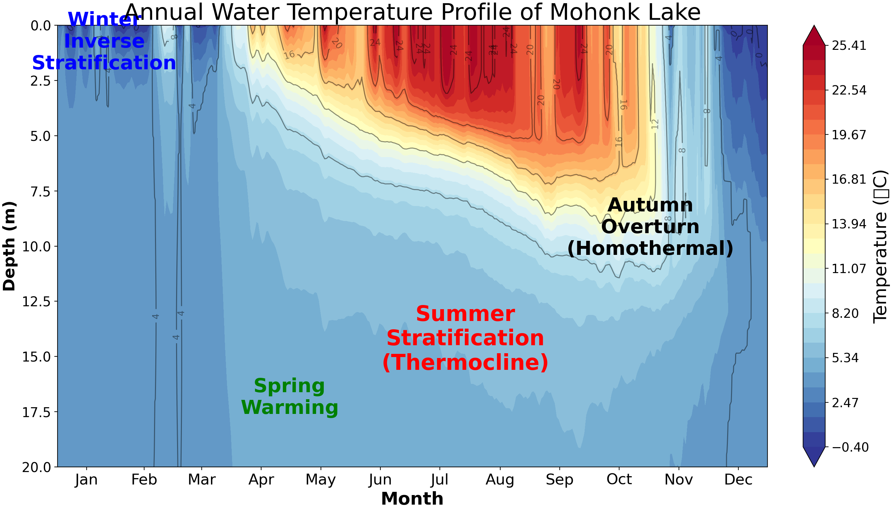
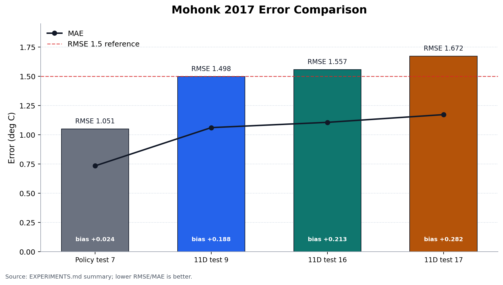
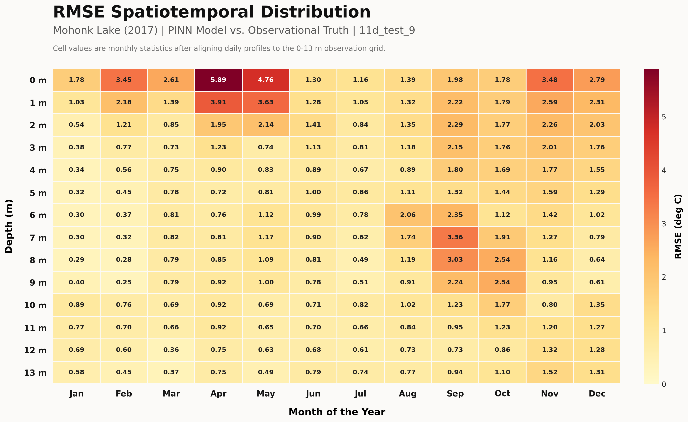
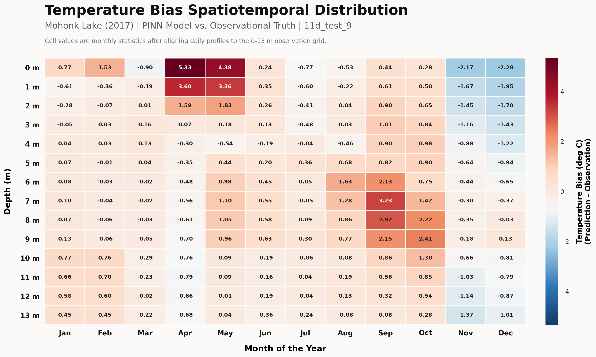

# PINN-

湖泊温度剖面预测与物理约束 PINN / PPO 实验仓库。项目以 ERA5 气象强迫、MODIS LST 表面温度和湖泊剖面观测为输入，预测湖泊逐日水温深度剖面 `T(z,t)`，并用物理约束、Kalman 同化和 PPO 调度改进季节结构与数值精度。

当前推荐继续研究的主入口是 `第三版/`。第二版虽然在 Mohonk 2017 上取得过最低 RMSE，但它属于旧输入结构，已移入 `归档/`，仅作为历史数值对照。

## 项目状态

这是一个研究型实验仓库，而不是打包发布的 Python 库。仓库只保存代码、文档和精简结论；原始数据、训练 checkpoint、预测 CSV、热图和大批量实验输出保留在本地或单独发布位置。

当前定位：

- `第三版/PPO策略调控_11维主线_20260426.py` 是当前 11 维 PINN + PPO/Kalman 主线。
- `第三版/PPO策略调控_热收支A线_20260428.py` 是热收支 A 线实验方向。
- `归档/第二版/PPO策略控制.py` 是历史数值最优对照，不作为当前主线继续扩展。

## 结果快照

以下结果基于 Mohonk 2017 预测 CSV 与 `MohonkLake_temp_2017_filled_from_2014_2017.csv` 对齐后的评分。模型选择不能只看 RMSE，还需要结合冬季逆温、夏季分层、秋季翻混、漂移和温跃层结构。

| 实验 | RMSE | MAE | bias | 当前判断 |
|---|---:|---:|---:|---|
| `策略测试/七` | 1.051 | 0.734 | 0.024 | 数值精度最好，旧输入结构对照 |
| `11维测试/九` | 1.498 | 1.061 | 0.188 | 当前 11 维主线候选 |
| `11维测试/十六` | 1.557 | 1.106 | 0.213 | 热收支 A3，对主线有参考价值 |
| `11维测试/十七` | 1.672 | 1.172 | 0.282 | A4 预测侧仍需改进 |

更完整的实验定位见 [`EXPERIMENTS.md`](./EXPERIMENTS.md)。

## 代表图像

主线 `11维测试/九` 的 Mohonk 2017 年度温度剖面热图：



Mohonk 2017 关键版本误差对比：



主线 `11维测试/九` 的月-深度误差诊断图。下图将每日预测剖面与 0-13 m 观测网格对齐后，按月份和深度统计误差；RMSE 反映误差强度，bias 反映预测相对观测的系统性偏高或偏低。该诊断显示，误差主要集中在春季表层升温阶段和秋季中深层翻混阶段。





## 快速入口

- 当前 11 维主线：[`第三版/PPO策略调控_11维主线_20260426.py`](./第三版/PPO策略调控_11维主线_20260426.py)
- 热收支实验线：[`第三版/PPO策略调控_热收支A线_20260428.py`](./第三版/PPO策略调控_热收支A线_20260428.py)
- 评分工具：[`第三版/lake_profile_scorecard.py`](./第三版/lake_profile_scorecard.py)
- 复现说明：[`REPRODUCE.md`](./REPRODUCE.md)
- 数据格式说明：[`DATA.md`](./DATA.md)
- 模型原理说明：[`MODEL.md`](./MODEL.md)
- 实验结论摘要：[`EXPERIMENTS.md`](./EXPERIMENTS.md)

## 环境

建议使用 Python 3.10 或更新版本。

```powershell
pip install -r requirements.txt
```

根目录 `requirements.txt` 覆盖当前第三版主线代码。归档目录中的早期下载脚本可能还需要额外依赖，例如 `cdsapi`、`xarray` 或 `seaborn`。

## 数据与复现

运行训练或预测前，需要按 [`DATA.md`](./DATA.md) 准备：

- ERA5 daily forcing CSV。
- MODIS LST surface observation CSV。
- 可选 profile observation CSV，用于训练、同化和评分。
- 已训练 PINN checkpoint，用于 `--mode predict`。

公开复现模板见 [`REPRODUCE.md`](./REPRODUCE.md)。当前机器上的绝对路径可放在未提交的 `REPRODUCE_LOCAL.md` 中，该文件已加入 `.gitignore`。

## 最小运行示例

训练主线模型：

```powershell
python ".\第三版\PPO策略调控_11维主线_20260426.py" `
  --mode train `
  --era5 "path\to\ERA5_daily.csv" `
  --lst "path\to\LST_2017.csv" `
  --profile-obs "path\to\profile_observations.csv" `
  --profile-split-mode time_blocked `
  --epochs 600 `
  --output-dir "outputs\run_main"
```

使用已训练 checkpoint 预测：

```powershell
python ".\第三版\PPO策略调控_11维主线_20260426.py" `
  --mode predict `
  --era5 "path\to\ERA5_daily.csv" `
  --lst "path\to\LST_2017.csv" `
  --model-checkpoint-path "outputs\run_main\mohonk_lake_2017_pinn_model_checkpoint.pt" `
  --output-dir "outputs\predict_main"
```

评分预测结果：

```powershell
python ".\第三版\lake_profile_scorecard.py" `
  --truth "path\to\profile_truth.csv" `
  --pred "outputs\predict_main\mohonk_lake_2017_pinn_temperature_depth_predictions.csv" `
  --label "main_predict" `
  --out-dir "outputs\score_main"
```

## 版本定位

| 目录/脚本 | 定位 | 对应实验 | 当前判断 |
|---|---|---|---|
| `第三版/PPO策略调控_11维主线_20260426.py` | 11 维 PINN + PPO/Kalman 主线 | `11维测试/九` | 当前推荐继续研究 |
| `第三版/PPO策略调控_热收支A线_20260428.py` | 能量版热收支实验线 | `11维测试/十一` 到 `11维测试/十七` | 有价值，但暂不替代主线 |
| `归档/第二版/PPO策略控制.py` | 旧输入结构 PPO | `策略测试/七` | 数值 RMSE 最低，但不作为当前主线 |
| `归档/第一版`、`归档/第零版` | 早期历史版本 | 早期流程 | 仅用于回溯 |

## 仓库结构

```text
PINN-
|-- README.md
|-- DATA.md
|-- MODEL.md
|-- EXPERIMENTS.md
|-- REPRODUCE.md
|-- requirements.txt
|-- 第三版/
|   |-- PPO策略调控_11维主线_20260426.py
|   |-- PPO策略调控_热收支A线_20260428.py
|   |-- lake_profile_scorecard.py
|   `-- README.md
`-- 归档/
    |-- 第二版/
    |-- 第一版/
    `-- 第零版/
```

## 不提交的内容

以下内容建议保留在本地实验目录，不直接提交到 GitHub：

- 原始数据和验证数据。
- 训练 checkpoint，例如 `*.pt`、`*.pth`、`*.ckpt`。
- 预测输出 CSV 和热图 PNG。
- `11维测试/`、`策略测试/`、`score_outputs*/` 等大批量实验结果目录。

这些内容更适合在论文、报告或发布版本中整理为摘要表、评分表和代表性图像。
