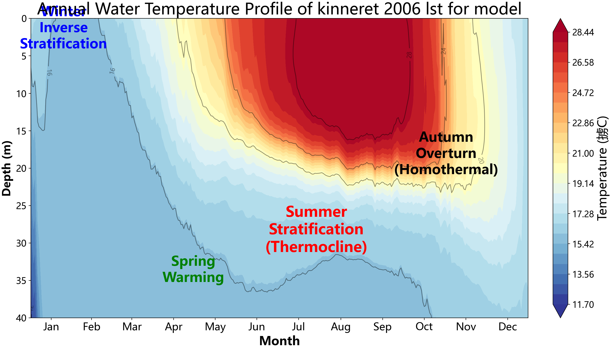
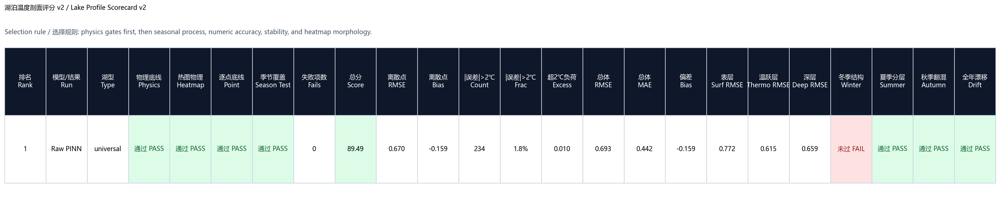
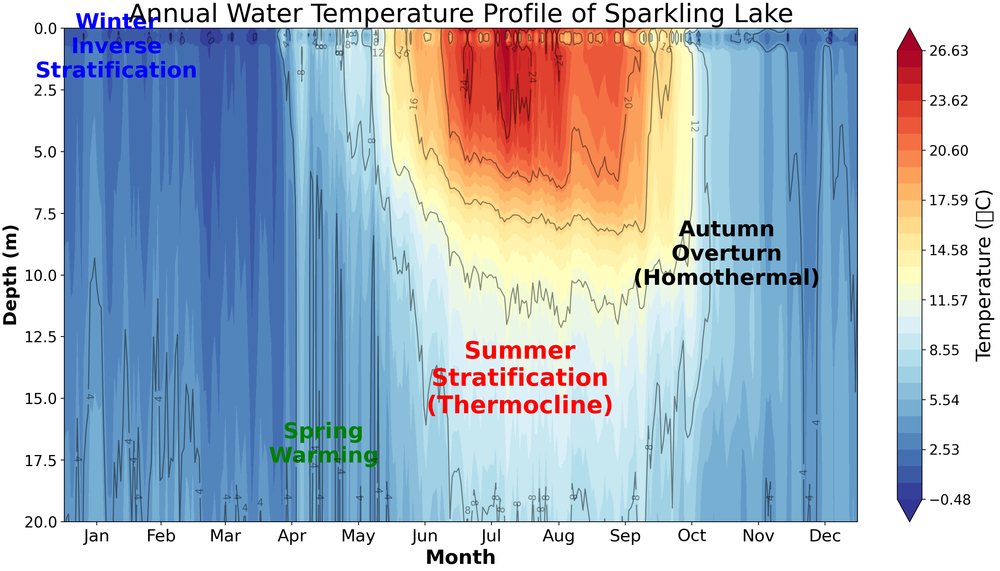
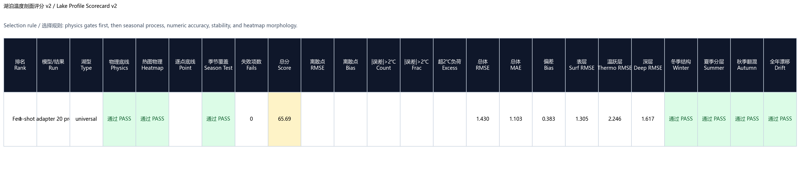
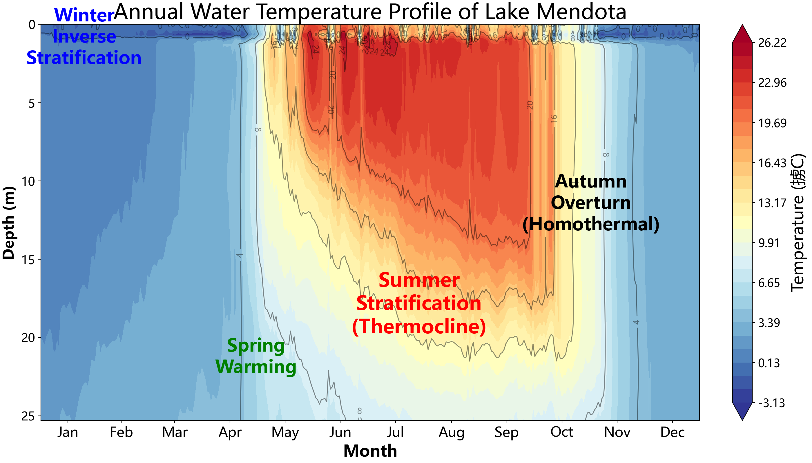
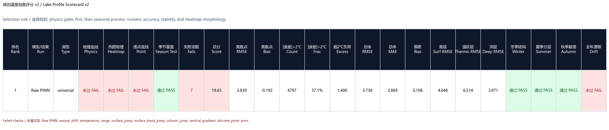
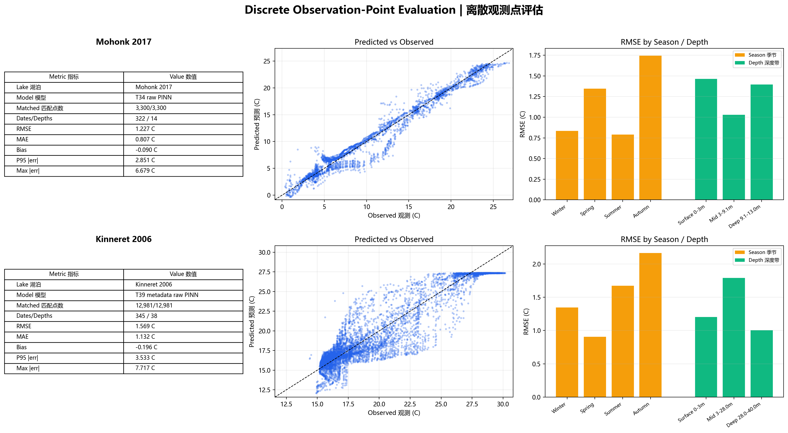

# 第六版实验总结

第六版这一轮实验的重点不再只是 Mohonk 单湖精度，而是检查 LakePINN 能否扩展到多湖、暖深湖和少量观测迁移场景。完整实验输出保留在本地第六版实验目录，仓库中只记录摘要和代表图。

## 最佳实验记录

| 实验方向 | 最佳/代表实验 | 评价口径 | RMSE | MAE | bias | 备注 |
|---|---|---|---:|---:|---:|---|
| Kinneret 单湖 raw PINN | `T54_Kinneret修复时间步长后T51微调` | profile validation，12981 matched rows | 0.670 | 0.443 | -0.159 | 本轮数值最好，scorecard 物理底线通过 |
| Kinneret 物理记忆修复 | `T57_Kinneret一月深层记忆修复` | profile validation，12981 matched rows | 0.727 | 0.482 | -0.090 | 数值略低于 T54，但一月深层记忆更稳，物理底线通过 |
| Sparkling few-shot | `lakeSpecificResidual_softBound_surfaceUniform_20d` | held-out profiles，5175 matched rows | 1.402 | 1.078 | 0.340 | 20 个剖面日期适配，scorecard 物理底线通过 |
| Mendota leave-one-lake zero-shot | `LOO_03_train_Mohonk_Sparkling_Erken2019_test_Mendota` | training summary best validation checkpoint | 1.079 | - | - | 训练 Mohonk + Sparkling + Erken2019，留出 Mendota 测试 |
| Mohonk 对照 | `T34_rawPINN_noRolling_noKalman_noPPO_20260511` | 离散观测点评估，3300 matched points | 1.227 | 0.807 | -0.090 | 第六版 T55/T56 没有超过 T34，对 Mohonk 仍保留第五版 T34 作为参考 |

## 代表图

Kinneret T54 年度热图与 scorecard：

Sparkling 20d few-shot 年度热图与 scorecard：

Mendota leave-one-lake zero-shot 年度热图与 scorecard：

双湖离散点评估总图：

## 结论

- Kinneret 方向的关键改进来自时间步长热收支修复、T51 后续微调和 warm/deep lake 约束。T54 是本轮 Kinneret 数值最优结果。
- T57 说明一月深层记忆约束可以改善暖深湖冬季结构，值得作为下一轮物理项继续保留。
- Global adapter 路线已经可以做多湖联合训练和 leave-one-lake 测试，但不同湖之间误差仍不均衡，Mendota 留出测试是目前最好的泛化样例。
- Sparkling few-shot 显示 20 个剖面日期足以把 held-out RMSE 降到约 1.40，并且 soft bound + surface uniform 组合能够通过物理底线。
- Mohonk 方向第六版没有替代第五版 T34；对 Mohonk 继续使用 T34 作为公开参考更稳。

## 下一步

- 把 Kinneret T54/T57 的 warm/deep lake 物理项抽象成可配置策略，避免只对单湖调参。
- 对 global adapter 增加跨湖加权和 lake-specific residual 的统一选择标准，减少不同湖误差不均衡。
- 对 few-shot 方向继续比较 5d、10d、20d 的最小观测需求，并检查表层偏差和深层 bias 的权衡。
