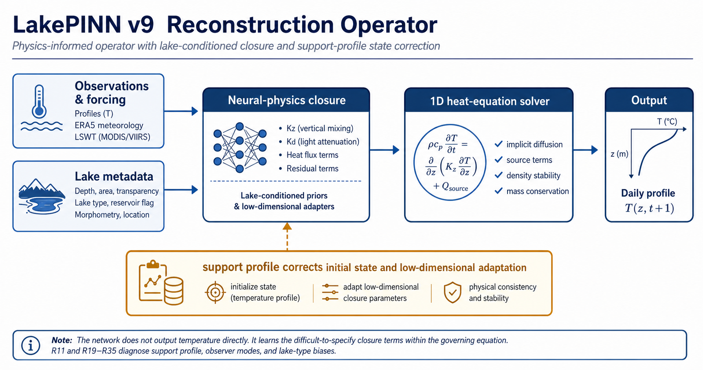
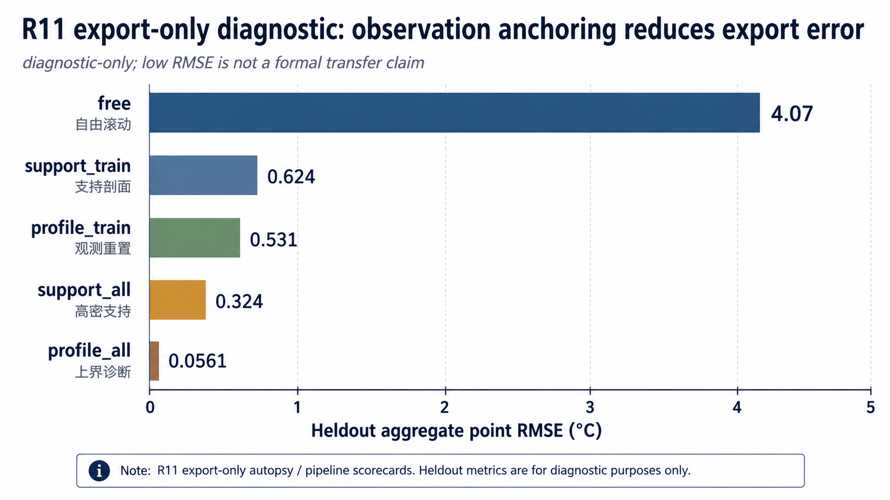
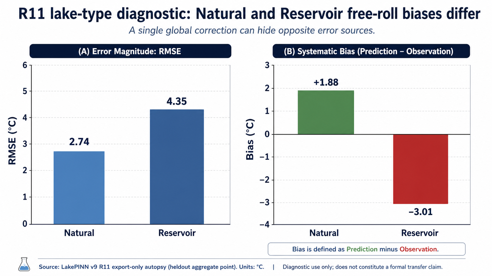

# 第九版：reconstruction 诊断与 support 迁移主线

第九版是当前主线。它在第八版跨湖泛化 R9 基线之后，重点排查 zero-profile reconstruction、support profile 校正、few-shot 迁移和 LSWT observer 更新的误差来源。该版不把 diagnostic-only export 当作正式泛化主结果，而是用分层实验和 closeout 指标判断下一步模型改动是否值得长跑。

本目录只保存可维护源码、测试、脚本和说明文档。完整 `experiments/`、`results/`、checkpoint、CSV、日志和缓存文件不进入 GitHub。

## 目录结构

```text
第九版/
|-- README.md
|-- 更新说明.md
|-- 实验总结.md
|-- requirements.txt
|-- lake_pinn/
|-- scripts/
`-- tests/
```

## 主要能力

- reconstruction-state 状态推进和 zero-profile 初始化诊断。
- support profile assimilation 与 query-start profile 校正。
- sparse observer、LSWT observer autopsy 和 lake-type 偏差诊断。
- L1/L2/L3/L4/L7 分层 smoke、diagnostic 和 overnight 实验编排。
- 1d closed-loop consistency、support update effect、R11 export-mode 和 lake-type bias/RMSE 诊断。

## 主记录

公开主记录为：

```text
RECON_L3_SUPPORT_DELTA_MAGNITUDE_OVERNIGHT_v1
checkpoint: best_by_val_rolling.pt
epoch: 47
```

| 指标 | 数值 |
|---|---:|
| selection score | 2.441 |
| val few-shot 30d RMSE | 2.486 |
| val few-shot 60d RMSE | 2.396 |
| val rolling-start 30d RMSE | 1.995 |
| val rolling-start 60d RMSE | 2.233 |

## 代表图







完整指标见 [`实验总结.md`](./实验总结.md)。

## 运行入口

```powershell
Push-Location ".\第九版"
python -m lake_pinn --help
Pop-Location
```

训练示例：

```powershell
Push-Location ".\第九版"
python -m lake_pinn `
  --manifest "..\path\to\manifest.json" `
  --output-dir "..\outputs\v9_run" `
  --epochs 120 `
  --device cpu
Pop-Location
```

## 验证

```powershell
python -m compileall -q .\第九版\lake_pinn .\第九版\tests .\第九版\scripts
Push-Location .\第九版; python -m pytest tests -q; python -m lake_pinn --help > $null; Pop-Location
```
