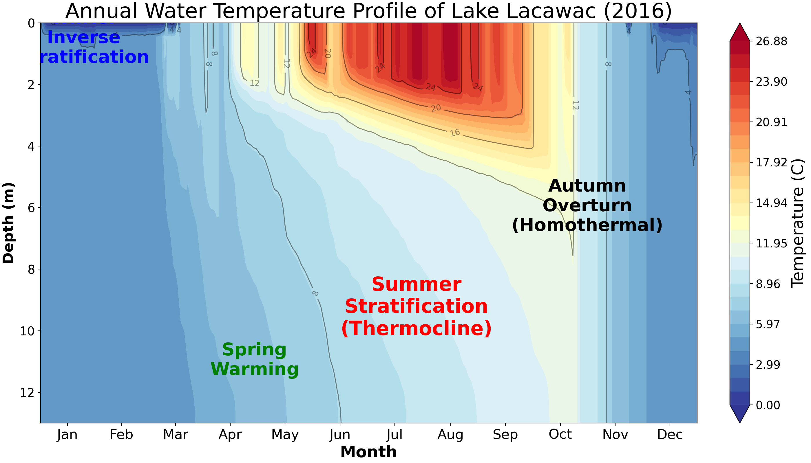
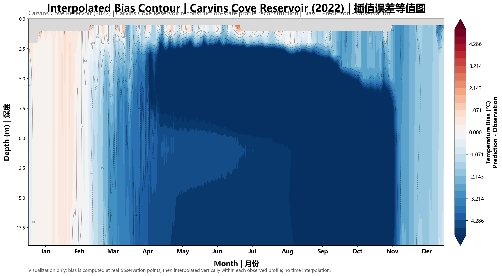
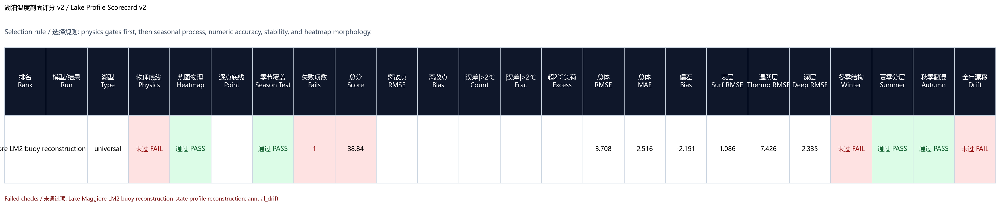

# 第八版：跨湖泛化 LakePINN 主线

第八版是当前主线。它在第七版 reconstruction-state / state-space forecaster 的基础上，继续推进跨湖泛化和长时段滚动稳定性，重点加入 extended metadata、temporal adaptive、LST dropout、segment LST weak loss、surface/ice latent reservoir、warm-column heat-content loss，以及 roll60/export25 公开导出口径。

本目录只保存可维护源码、测试、脚本、benchmark 脚本和说明文档。完整 `experiments/`、`external/`、`_archive/`、checkpoint、CSV、日志和缓存文件不进入 GitHub。

## 目录结构

```text
第八版/
|-- README.md
|-- 更新说明.md
|-- 实验总结.md
|-- CLOUD_GPU_README.md
|-- requirements.txt
|-- lake_pinn/
|-- scripts/
|-- benchmarks/
`-- tests/
```

## 主要能力

- 多湖 manifest 训练和整湖 heldout 评估。
- reconstruction-state 状态推进，支持 segment rollout、rolling horizon 和 export-only。
- 扩展湖泊 metadata 与条件先验，增强跨湖泛化。
- temporal adaptive、LST dropout、segment LST weak loss 和 warm-column heat-content loss。
- 年度热图、bias contour、离散观测点评估、scorecard 和热闭合诊断导出。
- PGDL-WRR 2019 Mendota benchmark 对照脚本。

## 主结果

公开主结果为：

```text
R9_WARMCOL_LST_SURFICE_ALL38_holdout3_120ep_roll60_export25_20260605
checkpoint/export: epoch0099
```

| Lake-year | RMSE | bias | 判断 |
|---|---:|---:|---|
| `lacawac_2016` | 2.405 | -0.244 | 表现最好，偏差较小 |
| `carvins_cove_2022` | 5.456 | -4.047 | 冷偏明显，下一版重点 |
| `lake_maggiore_2024` | 3.708 | -2.191 | 相比 R7 有改善 |
| 三湖平均 | 3.856 | 2.161 absolute bias | 相比 R7 的 4.158 / 2.455 改善 |

## 代表图







完整图像索引见 [`实验总结.md`](./实验总结.md)。

## 运行入口

```powershell
Push-Location ".\第八版"
python -m lake_pinn --help
Pop-Location
```

训练示例：

```powershell
Push-Location ".\第八版"
python -m lake_pinn `
  --manifest "..\path\to\manifest.json" `
  --output-dir "..\outputs\v8_run" `
  --epochs 120 `
  --device cpu
Pop-Location
```

## 验证

```powershell
python -m compileall -q .\第八版\lake_pinn .\第八版\tests .\第八版\scripts .\第八版\benchmarks
Push-Location .\第八版; python -m pytest tests -q; python -m lake_pinn --help > $null; Pop-Location
```

当前本地验证结果：`149 passed`。
