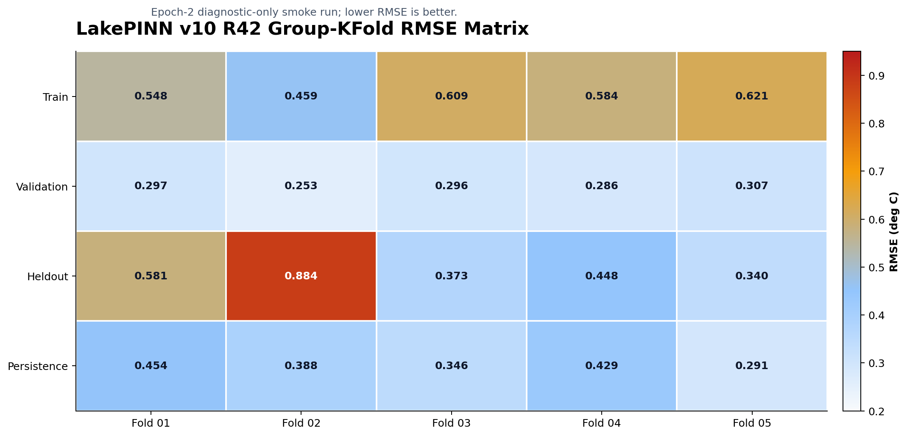
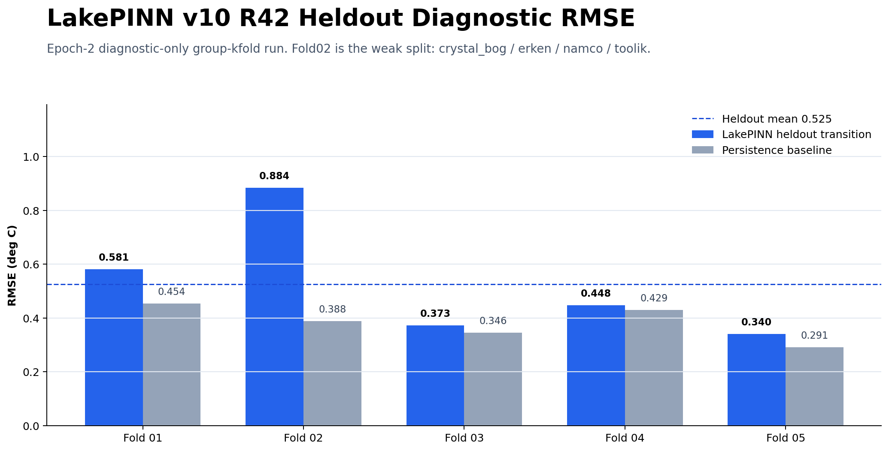
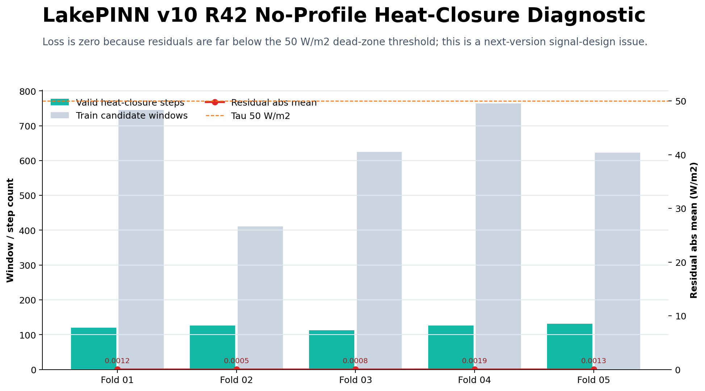

# 第十版：zero-profile reconstruction-state 诊断主线

第十版是当前 LakePINN 主线。它从第九版的 reconstruction / support 迁移诊断继续推进，重点收窄到 zero-profile reconstruction-state、EOF/PCA init-net、daily-memory 分支、init-physics-rollout 主线和无剖面 heat-closure 诊断。

本目录只保留可维护源码、测试、脚本和说明文档。完整 `experiments/`、`results/`、checkpoint、CSV、日志和缓存文件不进入 GitHub。

## 目录结构

```text
第十版/
|-- README.md
|-- 更新说明.md
|-- 实验总结.md
|-- lake_pinn/
|-- scripts/
|-- tests/
|-- .gitignore
`-- .source_packageignore
```

## 主要能力

- `python -m lake_pinn` 继续作为 multi-lake reconstruction-state 训练与导出入口。
- zero-profile 初始化支持 low-DOF、EOF/PCA thermal basis 和 init-net correction。
- `daily_memory` 分支用于逐日低秩剖面记忆，与 `init_physics_rollout` 主线做对照。
- `unlabeled_heat_closure.py` 支持无剖面日期的 heat-closure window 构造。
- `scripts/initial_column_eval.py` 用于按湖泊和深度带评估 zero-profile initial column 误差。
- `scripts/export_source_package.py` 用于导出干净源码包，避免把本地结果和 checkpoint 一起打包。

## 主记录

公开主记录为：

```text
RECON_R42_GROUPKFOLD_V1_fold01-05_6H_SUBMIT
```

该记录是 5-fold group-kfold smoke/diagnostic，5/5 folds 完成到 epoch 2。heldout 指标为 diagnostic-only，用于判断第十版代码路径和诊断信号，不作为最终跨湖泛化 formal claim。

| 指标 | 数值 |
|---|---:|
| train mean RMSE mean | 0.564 |
| validation mean RMSE mean | 0.288 |
| heldout transition RMSE mean | 0.525 |
| heldout transition RMSE median | 0.448 |
| heldout transition RMSE min / max | 0.340 / 0.884 |
| heldout persistence RMSE mean | 0.381 |
| Kd multiplier mean / p95 mean | 1.009 / 1.017 |
| Kd saturation fraction | 0.000 |
| unlabeled heat-closure loss | 0.000 |

| Fold | Heldout groups | Heldout RMSE | Persistence RMSE | 说明 |
|---|---|---:|---:|---|
| fold01 | falling_creek_reservoir, green_lake_4, mohonk, sunapee | 0.581 | 0.454 | diagnostic |
| fold02 | crystal_bog, erken, namco, toolik | 0.884 | 0.388 | 当前弱点 |
| fold03 | barco, kinneret, sammamish, sparkling, trout_lake | 0.373 | 0.346 | diagnostic |
| fold04 | beaverdam_reservoir, el_val, lake_washington, suggs | 0.448 | 0.429 | diagnostic |
| fold05 | lough_feeagh, mendota, rimov, trout_bog | 0.340 | 0.291 | diagnostic |

## 代表图







## 运行入口

```powershell
Push-Location ".\第十版"
python -m lake_pinn --help
Pop-Location
```

训练示例：

```powershell
Push-Location ".\第十版"
python -m lake_pinn `
  --manifest "..\path\to\manifest.json" `
  --output-dir "..\outputs\v10_run" `
  --epochs 20 `
  --device cpu
Pop-Location
```

## 验证

```powershell
python -m compileall -q .\第十版\lake_pinn .\第十版\tests .\第十版\scripts
Push-Location .\第十版; python -m pytest tests -q; python -m lake_pinn --help > $null; Pop-Location
```
